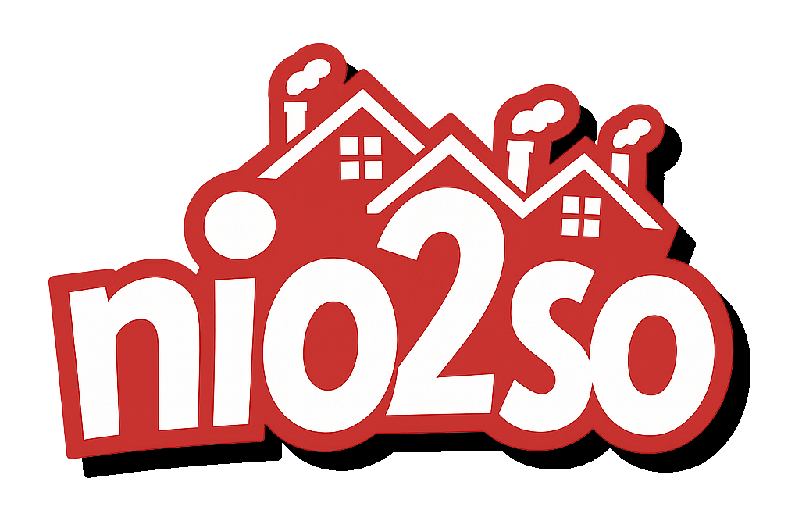

 
   

### New Implementation Of The Sims Online (Version 2)

<b>A continuation of niotso (The Sims Online).</b> This project successfully emulates the server program <i>The Sims Online: Pre-Alpha</i> interfaces with to create the gameplay experience as it were in May 2002.

<figure>
  
  <figcaption></figcaption>
</figure>

An image of <b>TSOView2</b> rendering the terrain of the city "Blazing Falls" as it would appear in The Sims Online: Pre-Alpha.

<i>More info in the [wiki](https://github.com/JDrocks450/nio2so/wiki/TSOView2-City-Viewer).</i>

## Project Roadmap & Reference Materials
**Roadmap** You can visit the project roadmap here: [Roadmap](https://github.com/JDrocks450/nio2so/wiki/Roadmap-for-nio2so)

**Original Project** - The original project can be found archived here: [Niotso - GitHub](https://github.com/daddesio/niotso)

**Machuga Client (original proof-of-concept for niotso)** -
The mashuga client can be found here: [Machuga - GitHub](https://github.com/daddesio/mashuga)

**Maxis Protocol Documentation** -
Here is some helpful reading: [Maxis Protocol (Niotso Wiki)](http://wiki.niotso.org/Maxis_Protocol)

**Technical Write-Up** -
Here is a document I update periodically about various systems in the game and interesting findings. It also contains documentation taken from the original creator. [Technical Analysis of The Sims Online: Pre-Alpha](/nio2so.TSOTCP.City/Documentation/Technical%20Analysis%20of%20The%20Sims%20Online.pdf)

**TCRF Article**
Much of the accomplishments through nio2so have been documented in this article, to preserve and understand this facinating version of the game. [See more on The Cutting Room Floor](https://tcrf.net/Proto:The_Sims_Online/TSO_Pre-Alpha)

## Nio2so Compatible-Versions of The Sims Online
**TSO Pre-Alpha 1.3.2.56**

*Beta/Tuning 1.3.1.56, a version compiled on/around May 9th, 2002.*

> *nio2so protocol compatibility: mostly complete.*

**TSO Play-Test 1.3.2.81**

*A version compiled on/around September 21st, 2002.*

>nio2so protocol compatibility: barely started.

You will hear these versions referred to as only Pre-Alpha or Play-Test in this project.

## Summary
nio2so (and niotso) are/were projects aimed to restore The Sims Online in its unaltered state by emulating the server the game interacted with back when the game was online.

Disclaimer: nio2so currently is used for research purposes for discovery about the above mentioned versions. It has not been tested/designed for any other versions, currently.

### Sitemap
nio2so many components. Some major ones are:
 * **nio2so.TSOHTTPS** - This handles the all HTTP(S) communication with the game client. They're configured for HTTP & HTTPS.
 * **nio2so.TSOProtocol** - This is the schema used for HTTP and HTTPS communcation.
 * **nio2so.TSOTCP.Voltron** - This emulates the TSO: Pre-Alpha/Play-Test City server. This server uses TCP as the transport layer and it was based on Cadence, Aries and Voltron at Maxis.
 * **nio2so.DataService** - The DataService supplies data to the nio2so Voltron-compatible server. Communication is handled through an HTTP client originating from the TSONeoVol2ronServer.
 * **TCPQuaZar** - A TCP server framework I designed for use in various applications: https://github.com/JDrocks450/TCPQuaZar. A basic TCP Client/Server.

## Setting up
You do need a copy of The Sims Online: Pre-Alpha installed on your system. I would recommend one installation per running TSOClient.exe instance.

I recommend using DxWnd as this game is quite buggy nowadays. Also look into replacing the graphics library The Sims uses with a more modern one.

### Clone the Repository
Clone the repository, ensure you have .NET Framework installed on your system and the latest version of Visual Studio.

I would highly recommend editing your StartUp Project Settings to match mine:

**Ensure you have the following projects running simultaneously when attempting to use nio2so:**
* TSOHTTPS - This allows you to login into The Sims Online, and nio2so.
* TSOTCP.Voltron.Server - Voltron is the TCP Server that is compliant with the Pre-Alpha (mostly complete) & Play-Test (early beta) protocols
* DataService.API - The data service must be running in order to track and save progress and simulate the online gameplay.

*Please ensure you have necessary self-signed certificates for the TSOHTTPS and DataService servers. Visual Studio can help you with this if you're unfamiliar.*

**Build & Run**, ensure there are no build errors. *Do not set your server settings yet, if prompted by nio2so - leave this window open.*

### Set your nio2so Server Settings
On first run, you will be prompted to edit some settings. Please make sure they're applicable to what your goals are. Change them between runs of your server if you like. 

**Make sure that you set whether or not you're using a Pre-Alpha client or not. You can't join with a Play-Test copy to a Pre-Alpha server, and vice versa.**

### Edit your hosts file
Since the Pre-Alpha build is hard-coded to connect to specific addresses, the easiest way to get up and running is to ensure your Hosts File in Windows has these additions:

  `127.0.0.1 www.ea.com`

  `127.0.0.1 ea4.dev.ea.com`

  `127.0.0.1 xo.max.ad.ea.com`

These will intercept network traffic from the TSOClient.exe to the nio2so **TSONeoVol2ronServer** running on your PC.

### Boot-up The Sims Online Pre-Alpha (or Play-Test)
*If using Play-Test, you can skip this section. Just load up your game client.*

This was designed to run with an unmodified client. However, it's basically required for you to use FatBag's patches, due to the nature of using The Sims Online: Pre-Alpha. It is detailed more thoroughly in this wiki article: http://wiki.niotso.org/Maxis_Protocol

Luckily, in the Releases section, I have packaged a ZIP with two patched Pre-Alpha TSOClient.exe executables in it. I have used a Hex Editor to make one executable a **server** and one a **client**. (it's a single bit swap)

One instance should be a server, this will be the HOST. Now, all subsequent instances should be a client instance, that will connect to the host server instance's lot.

*Please do not use the same installation for the server and the client(s). They will fight over resources in the installation directory and cause crashes and hangs.

Run both instances with these runtime arguments: `-w -debug_objects` (not required, but recommended)

Next step.

### Demonstration YouTube Video
Before continuing with the instructions, you can refer to this YouTube video I recorded to see how it works in action:
https://www.youtube.com/watch?v=8wcedhRtuLs&t=11s

### Logging in
Run the nio2so StartUp Project configuration I showed you above. It will launch three servers. The `TSOHTTPS`, `DataService` and `TSOTCP.Voltron.Server` servers. _They all are required._

Type in your username and password. Password can't be blank! I thought of that, too. (Check out the AuthLogin controller in TSOHTTPS)
*If you don't have a username and password yet, just type one in. The **DataService** server will store your information.*

First, The Sims Online client will connect on TSOHTTPS. Nio2so is automatically configured to respond on both HTTP & HTTPS connections. If both of these aren't running, you won't get far.

*Please note: Play-Test and later clients will use an encrypted stream over SSL. Nio2so can be SSL-compatible, just make sure to adjust your nio2so server settings accordingly.*

### Select-A-Sim and beyond
Go ahead and make an avatar, if you haven't already. Your avatar will be stored using the **DataService**. 

Next time you login, your avatar will be waiting for you :)

The Map View and beyond are still in research stages, though Pre-Alpha's protocol is mostly cracked and implemented into nio2so as of writing this.

Remember to check out this article for some examples of things you can try out. [See more on The Cutting Room Floor](https://tcrf.net/Proto:The_Sims_Online/TSO_Pre-Alpha)

## Getting into a Lot
Take your server instance detailed in a prior step, and join a house you own, you can also buy one at this time. The first connection to a house will be assumed to be the _host (server) instance_.

Then, open a client instance and join the aforementioned lot. If it's not online yet, give it time. This game is over 25 years old, afterall.

## Voltron? Cadence? Aries? What are you talking about?
Below is a summary of some aspects of The Sims Online networking:
 * **Cadence** - Cadence & CadenceClient are the lowest level transport for TCP communication. They're libraries facilitating the transport of data using TCP. This isn't too important.
 * **Aries** - Aries is the next level up on top of Cadence. Aries has AriesPackets, which have a Type, timestamp, and size. [Read up about it more here](http://wiki.niotso.org/Maxis_Protocol#Aries_packets)http://wiki.niotso.org/Maxis_Protocol#Aries_packets.
Aries, in truth, isn't really crucial either since the Sims Online development team made Voltron packets which do a similar thing as Aries.
 * **Voltron** - It's the protocol The Sims Online used to create the gameplay experience. Every action the Client can perform is largely dictated using Voltron Packets (Pre-Alpha calls these PDUs). PDUs are sent and received from Regulators (controllers, basically). A Regulator handles a certain aspect of the Engine powering the game. For example, there is a LoginRegulator which handles... logging in!

*Voltron is what is referred to as the protocol for The Sims Online. nio2so implements this as the TSONeoVol2ronServer -- which is capable of running as a Pre-Alpha compliant or Play-Test compliant server.**

## Voltron Packets & PDUs
Voltron as a framework uses Voltron Packets wrapped inside of Aries Packets to get the job done. [The structure of a Voltron Packet can be found here.](http://wiki.niotso.org/Maxis_Protocol#Voltron_packets)

In summary, Voltron Packets have:
 * Voltron Packet Type (PDU ID)
 * Payload Size

**Please note that nio2so uses runtime serialization of all PDU types, using attributes. A custom serializer has been written, which is called the TSOVoltronSerializer**

[Here's a list of all TSO Pre-Alpha PDU IDs.](http://niotso.org/files/prealpha_pdu_tables.txt)

Don't want to use that link? There is an enum for you to use in code at TSOVoltronEnum.cs
In fact, for developers there are many enums in the same directory as TSOVoltronEnum.cs containing specific CLSIDs for other Packet Formats -- and an enum for all constants found in the game binary.

Each Voltron PDU is coded into the respective Pre-Alpha or Play-Test protocol assembly. Please look over these as a basis for the formatting if you which to develop this on your own. They are runtime-serialized, plan accordingly.

## Regulators & Protocols
Yes, regulators are controllers, basically. Each Regulator has a protocol that it uses. The protocol is the set of PDUs it can send/receive and how to interpret them. There are the following Protocols in The Sims Online: Pre-Alpha:
 * LoginProtocol
 * cGameMasterProtocol
 * RoommateProtocol
 * CitySelectorProtocol
 * SessionProtocol
 * FriendshipProtocol
 * Top100Protocol
 * BookmarkProtocol
 * MessageProtocol
 * SearchProtocol
 * VersionProtocol

Regulators are state-machines. They have a state they're currently in, and their state can transition to another one dictated by how they're programmed. 

Regulators will see the incoming PDUs each frame. If it's a message that Regulator can interpret, it will handle it accordingly. If not, it is passed up the chain. 

The developers referred to Regulators in the source code as cTSORegulator.cpp

## Areas of Operation
This project is a lot of Reverse-Engineering. Here's some helpful tips on what some assemblies generally do.

 * **cTSOServiceClientD.dll** - Database Operations
 * **cTSOVoltronDMServiceD.dll** - Voltron/City Server
 * **Aries.dll** - Packet Send/Receive
 * **Cadence.dll** - Packet Send/Receive
